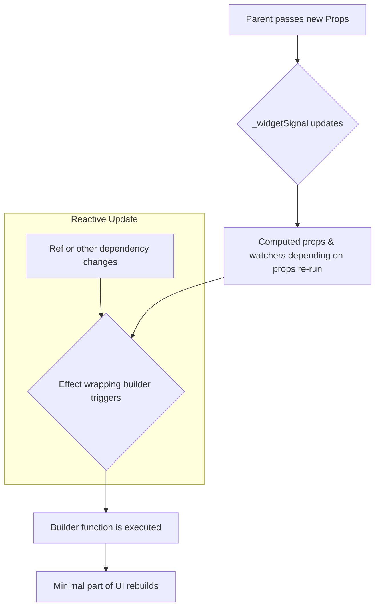

# Architecture Overview

`flutter_compositions` layers a thin runtime on top of Flutter's native `StatefulWidget` to provide a development experience similar to the Vue Composition API, while staying idiomatic to Flutter.

## Core Components

The framework consists of three main parts working in concert:

1.  **`CompositionWidget`**: The developer-facing abstract widget that provides the `setup()` method.
2.  **`_CompositionWidgetState`**: The actual `State` object for the `StatefulWidget`. It's responsible for managing the execution of `setup`, handling widget updates, and triggering reactive rebuilds of the `builder`.
3.  **`_SetupContext`**: An internal object created during `setup` execution and tied to the `State`. It's responsible for storing lifecycle callbacks, tracking effects, and handling the dependency chain for `provide/inject`.

## Detailed Lifecycle

The lifecycle of a `CompositionWidget` is as follows:

1.  **`initState`**: When a `CompositionWidget` is first added to the widget tree, the `_CompositionWidgetState`'s `initState` method is called.
2.  **Create `_SetupContext`**: In `initState`, a `_SetupContext` instance is created. It finds its parent `_SetupContext` by walking up the Element tree, forming a chain for `provide/inject`.
3.  **Execute `setup()`**: The `setup()` method is **executed only once at this time**. During this phase:
    *   Lifecycle hooks like `onMounted` and `onUnmounted` are registered with the `_SetupContext`.
    *   APIs like `ref`, `computed`, and `watch` are called to create reactive objects.
    *   `provide`d values are stored in the `_SetupContext`.
    *   `inject`ed values are read from the `_SetupContext` inheritance chain.
    *   Finally, `setup()` returns a `builder` function.
4.  **Create Render `Effect`**: The `State` creates an `alien_signals` `effect` that wraps the `builder` function. This `effect` is responsible for executing the `builder` and triggering `setState` when its dependencies change.
5.  **First Render**: The `builder` function is executed, producing the initial widget tree, which is then cached.
6.  **`didUpdateWidget`**: When the parent widget rebuilds and passes new props, `_CompositionWidgetState`'s `didUpdateWidget` is called. It updates an internal `_widgetSignal`, which is a reactive signal representing the current widget instance. The change in this signal automatically triggers re-computation of any `computed` that depends on it (e.g., computed properties created via `widget()`).
7.  **Reactive Updates**: When the value of any reactive dependency (like a `ref` or `computed`) used within the `builder` changes, the `effect` wrapping the `builder` is triggered. This, in turn, calls `setState`, which re-renders the widget using the `builder` function, achieving a minimal UI update.
8.  **`dispose`**: When the widget is removed from the tree, the `_CompositionWidgetState`'s `dispose` method is called. It sequentially executes `onUnmounted` callbacks and disposes of all effects registered during `setup` to prevent memory leaks.

## Reactive Flowchart

## Key Building Blocks

- **`ref(initialValue)`**: Creates a writable reactive signal, `Ref<T>`.
- **`computed(() => expr)`**: Creates derived data, `ComputedRef<T>`, that automatically updates based on its internal dependencies.
- **`watch` / `watchEffect`**: Registers callback functions to run when reactive data sources change.
- **`use*` functions**: Integrate Flutter controllers with automatic lifecycle management.
- **`widget()`**: Exposes the current widget instance as a reactive reference to handle prop changes.

## Error Prevention

The framework includes several assertions to help developers avoid common mistakes:

- Enforces that functions like `onMounted`, `provide`, and `inject` can only be called during the `setup()` execution phase.
- Throws a detailed error when `inject<T>()` fails to find a required dependency, guiding the developer on how to fix it.
- Effects registered via `watch` or `use*` functions are automatically bound to the `_SetupContext` and cleaned up during `dispose`.
