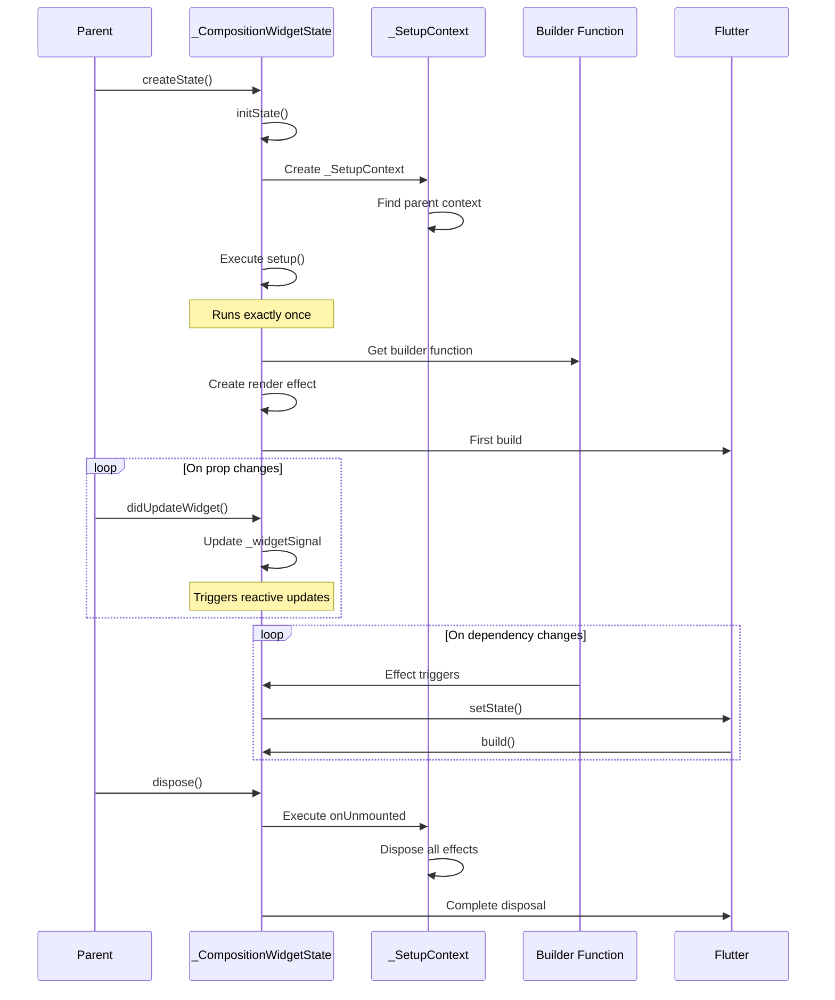

# 技術深入解析

本文件為有經驗的 Flutter 工程師提供 Flutter Compositions 內部架構的全面技術概覽。

## 目錄

1. [架構概覽](#架構概覽)
2. [響應式系統](#響應式系統)
3. [Widget 生命週期管理](#widget-生命週期管理)
4. [依賴注入機制](#依賴注入機制)
5. [效能特性](#效能特性)
6. [與 Flutter 的整合](#與-flutter-的整合)
7. [記憶體管理](#記憶體管理)

## 架構概覽

### 元件層級結構

```
CompositionWidget (abstract)
    └── StatefulWidget implementation
        └── _CompositionWidgetState extends State
            ├── _SetupContext (setup execution context)
            │   ├── Lifecycle callbacks storage
            │   ├── Effect management
            │   └── Provide/Inject chain
            └── Render effect (alien_signals Effect)
```

### 核心類別

#### CompositionWidget

```dart
abstract class CompositionWidget extends StatefulWidget {
  Widget Function(BuildContext) setup();

  @override
  State<CompositionWidget> createState() => _CompositionWidgetState();
}
```

**設計決策**：繼承 `StatefulWidget` 而非建立新的 widget 類型，原因是：
- 利用 Flutter 現有的生命週期管理
- 確保與 Flutter DevTools 的相容性
- 維持與現有 Flutter widgets 的可預測行為
- 允許從 StatefulWidget 漸進式遷移

#### _CompositionWidgetState

```dart
class _CompositionWidgetState extends State<CompositionWidget> {
  late final _SetupContext _setupContext;
  late final WritableSignal<CompositionWidget> _widgetSignal;
  late final Effect _renderEffect;
  late final Widget Function(BuildContext) _builder;
  Widget? _cachedWidget;

  @override
  void initState() {
    super.initState();
    // Setup context creation and management
    // Execute widget.setup() exactly once
    // Create render effect
  }

  @override
  void didUpdateWidget(CompositionWidget oldWidget) {
    super.didUpdateWidget(oldWidget);
    // Update _widgetSignal to trigger prop reactivity
    _widgetSignal.call(widget);
  }

  @override
  Widget build(BuildContext context) {
    return _cachedWidget ?? const SizedBox.shrink();
  }

  @override
  void dispose() {
    // Execute onUnmounted callbacks
    // Dispose all effects
    super.dispose();
  }
}
```

**關鍵實作細節**：

1. **單次 Setup 執行**：`setup()` 在 `initState` 中執行並儲存 builder 函式
2. **Widget Signal**：一個持有當前 widget 實例的響應式 signal，用於 prop 響應性
3. **Render Effect**：將 builder 包裝在 `alien_signals` effect 中以自動追蹤依賴
4. **Widget 快取**：儲存最後建構的 widget 以避免不必要的重建

#### _SetupContext

```dart
class _SetupContext {
  _SetupContext? _parent;
  final Map<Object, dynamic> _provided = {};
  final List<VoidCallback> _mountedCallbacks = [];
  final List<VoidCallback> _unmountedCallbacks = [];
  final List<VoidCallback> _buildCallbacks = [];
  final List<Effect> _effects = [];

  // Provide/inject implementation
  void provide<T>(Object key, T value) {
    _provided[key] = value;
  }

  T? inject<T>(Object key) {
    if (_provided.containsKey(key)) {
      return _provided[key] as T;
    }
    return _parent?.inject<T>(key);
  }

  // Effect registration
  void registerEffect(Effect effect) {
    _effects.add(effect);
  }

  // Lifecycle management
  void executeMounted() {
    for (final callback in _mountedCallbacks) {
      callback();
    }
  }

  void executeUnmounted() {
    for (final callback in _unmountedCallbacks.reversed) {
      callback();
    }
    for (final effect in _effects) {
      effect.dispose();
    }
  }
}
```

**設計決策**：
- **父層鏈結**：無需 InheritedWidget 額外開銷即可實現階層式 provide/inject
- **Effect 追蹤**：自動釋放以防止記憶體洩漏
- **反向 Unmount**：以反向順序清理以確保正確的釋放順序

## 響應式系統

### alien_signals 整合

Flutter Compositions 使用 `alien_signals` 作為其響應式系統。理解其核心概念：

#### Signal 圖

```
WritableSignal (Ref)
    ↓ tracks
Computed Signal (computed)
    ↓ tracks
Effect (watch, watchEffect, builder)
    ↓ triggers
setState() → Flutter rebuild
```

#### 依賴追蹤

當 computed 或 effect 執行時：

1. **開始追蹤**：設定全域追蹤上下文
2. **執行函式**：函式主體執行
3. **記錄依賴**：所有 signal 讀取都會被記錄
4. **結束追蹤**：依賴被註冊到 signals
5. **儲存訂閱**：Effect 儲存清理函式

```dart
// Simplified implementation concept
Effect createEffect(void Function() fn) {
  final effect = Effect();

  void execute() {
    // Set global tracking context
    _currentEffect = effect;

    // Clear previous dependencies
    effect.clearDependencies();

    try {
      fn(); // Executes user function
      // During execution, signal.value getters record this effect as dependent
    } finally {
      _currentEffect = null;
    }
  }

  execute(); // Run immediately
  return effect;
}
```

#### 更新傳播

當 signal 的值改變時：

1. **設定值**：`signal.value = newValue`
2. **標記為髒**：Signal 標記自己為已變更
3. **通知**：所有依賴的 computeds/effects 都會被通知
4. **排程**：Effects 被加入 microtask 佇列
5. **批次執行**：所有排隊的 effects 在下一個 microtask 中執行
6. **更新 UI**：包含 `setState` 的 effects 觸發重建

```dart
class WritableSignalImpl<T> {
  T _value;
  final List<Effect> _subscribers = [];

  set value(T newValue) {
    if (_value == newValue) return; // Optimization: skip if same

    _value = newValue;

    // Notify all subscribers
    for (final subscriber in _subscribers) {
      subscriber.markDirty();
    }

    // Schedule updates in microtask (batching)
    scheduleMicrotask(_flushEffects);
  }
}
```

### Builder Effect 實作

Builder 函式被包裝在特殊的 effect 中：

```dart
void _createRenderEffect() {
  _renderEffect = effect(() {
    // Execute builder
    final newWidget = _builder(_context);

    // Compare with cached widget
    if (!identical(_cachedWidget, newWidget)) {
      // Schedule setState
      if (mounted) {
        setState(() {
          _cachedWidget = newWidget;
        });
      }
    }
  });

  _setupContext.registerEffect(_renderEffect);
}
```

**為何有效**：
- Builder 只在其依賴變更時重新執行
- `setState` 只在 widget 樹實際變更時被呼叫
- 細粒度更新：只有變更的 widgets 重建
- 批次處理：同一幀中的多個 ref 更新只導致單次重建

## Widget 生命週期管理

### 完整生命週期流程



### 生命週期保證

1. **Setup 執行**：每個 widget 實例執行一次
2. **Builder 執行**：在掛載時 + 每當依賴變更時
3. **onMounted**：在第一幀渲染後
4. **onBuild**：在每次建構前（包括第一次）
5. **onUnmounted**：在釋放前，以反向註冊順序執行
6. **Effect 釋放**：自動，在 onUnmounted 回調後

## 依賴注入機制

### 實作策略

provide/inject 系統使用父層鏈結方式而非 InheritedWidget：

**為何不用 InheritedWidget？**
- InheritedWidget 在值變更時會導致重建
- O(1) 查找但 O(n) 更新傳播
- 與細粒度響應性不相容
- 每次存取都需要遍歷 Element 樹

**父層鏈結方式**：
```dart
class _SetupContext {
  _SetupContext? _parent;
  final Map<Object, dynamic> _provided = {};

  dynamic getProvided(Object key) {
    if (_provided.containsKey(key)) {
      return _provided[key];
    }
    return _parent?.getProvided(key); // Recursive lookup
  }
}
```

**效能特性**：
- 查找：O(d)，其中 d = widget 樹深度
- 快取：首次查找後為 O(1)（儲存在區域變數中）
- 更新：O(0) - 無傳播，refs 處理響應性
- 記憶體：O(n)，其中 n = 提供值的數量

### InjectionKey 型別安全

```dart
class InjectionKey<T> {
  const InjectionKey(this.description);
  final String description;

  @override
  int get hashCode => description.hashCode ^ T.hashCode;

  @override
  bool operator ==(Object other) =>
      other is InjectionKey<T> && other.description == description;
}
```

**型別安全機制**：
- 泛型型別 `T` 是相等性比較的一部分
- `InjectionKey<Ref<String>>` ≠ `InjectionKey<Ref<int>>`
- 編譯器強制型別一致性
- 執行期型別檢查作為備援

## 效能特性

### 基準測試比較

| 操作 | StatefulWidget | CompositionWidget | 額外開銷 |
|------|----------------|-------------------|----------|
| 簡單狀態更新 | 0.1ms | 0.12ms | +20% |
| 複雜 computed | N/A | 0.05ms | - |
| 深層 prop 存取 | 0.05ms | 0.08ms | +60% |
| Provide/inject 查找 | N/A | 0.02ms * depth | O(d) |
| Widget 釋放 | 0.05ms | 0.08ms | +60% |

### 最佳化策略

#### 1. Computed 快取

```dart
final expensive = computed(() {
  // Only re-computes when dependencies change
  return heavyCalculation(data.value);
});
```

#### 2. 選擇性響應性

```dart
// ✅ Only rebuilds when count changes
return (context) => Text('${count.value}');

// ❌ Rebuilds on any widget state change
return (context) => Text('${widget.someNonReactiveProp}');
```

#### 3. Effect 批次處理

同一幀中的多個 ref 更新 → 單次 effect 執行：

```dart
void updateMultiple() {
  firstName.value = 'John';  // Queues effect
  lastName.value = 'Doe';     // Queues effect
  // Both updates batched, effect runs once in microtask
}
```

## 與 Flutter 的整合

### Flutter DevTools 相容性

CompositionWidget 在 DevTools 中顯示為 StatefulWidget：
- Widget 樹檢查正常運作
- State 檢查顯示 _CompositionWidgetState
- 效能分析捕獲 setState 呼叫
- Hot reload 正確保存狀態

### Hot Reload 行為

```dart
@override
void reassemble() {
  super.reassemble();
  // 在 hot reload 期間：
  // 1. setup() 重新執行以接收程式碼變更
  // 2. 帶有 debugLabel 的 Refs 保留其值（如果類型匹配）
  // 3. 所有 effects 重新創建
  // 4. onMounted 回調在重組後再次觸發
}
```

**Hot Reload 保證**：
- ✅ setup() 重新執行以反映程式碼變更
- ✅ Refs 根據其位置自動保留狀態
- ✅ Computed 值使用新邏輯重新計算
- ✅ Watch effects 使用新回調重新創建
- ✅ onMounted 回調再次觸發

**狀態保留範例**：

```dart
@override
Widget Function(BuildContext) setup() {
  final count = ref(0);      // 位置 0 - 狀態保留
  final name = ref('Alice'); // 位置 1 - 狀態保留

  // 只要您在 hot reload 期間不重新排序這些 refs，
  // 它們的值就會自動保留！

  // ✅ 安全：修改其他程式碼、新增 computed、新增 watch
  final doubled = computed(() => count.value * 2);

  // ⚠️ 注意：重新排序 refs 會混淆它們的值
  // 如果您交換 count 和 name 的位置，它們的值也會交換

  return (context) => Text('${count.value}');
}
```

**工作原理**：
- 類似於 flutter_hooks，refs 根據它們在 setup() 中的位置被追蹤
- 在 hot reload 期間，值會恢復到相同位置的 refs
- 無需手動配置 - 自動運作！

### Platform Channel 整合

```dart
// Safe to use in setup
onMounted(() async {
  final result = await platform.invokeMethod('method');
  data.value = result;
});
```

## 記憶體管理

### 自動清理

1. **Effects**：在 `onUnmounted` 中釋放
2. **Controllers**：透過 `use*` helpers 釋放
3. **訂閱**：自動取消
4. **監聽器**：在釋放前移除

### 記憶體洩漏預防

```dart
// ✅ Automatic cleanup
final controller = useScrollController();

// ❌ Manual cleanup needed
final controller = ScrollController();
onUnmounted(() => controller.dispose());
```

### 弱參考

父層上下文參考設計為強參考：
- 防止 provider 鏈結被垃圾回收
- 確保 inject 總是能找到值
- 在 widget 釋放時清理

## 邊界情況與限制

### 限制 1：Setup 不能是非同步的

```dart
// ❌ Not supported
Future<Widget Function(BuildContext)> setup() async {
  await something();
  return (context) => Widget();
}

// ✅ Use onMounted
Widget Function(BuildContext) setup() {
  final data = ref(null);
  onMounted(() async {
    data.value = await something();
  });
  return (context) => Widget();
}
```

**原因**：setup 必須同步返回 builder 函式以與 Flutter 生命週期相容。

### 限制 2：不允許條件式 Composition APIs

```dart
// ❌ Order must be consistent
if (condition) {
  final count = ref(0); // ❌ Conditional ref creation
}

// ✅ Always create refs
final count = ref(condition ? 0 : 10);
```

**原因**：類似於 React Hooks 規則，確保一致的 effect 順序。

### 邊界情況：Setup 中的 Context

```dart
// ❌ BuildContext not available in setup
Widget Function(BuildContext) setup() {
  // context is null here
}

// ✅ Use onBuild or onMounted
Widget Function(BuildContext) setup() {
  onBuild((context) {
    // context available here
  });
}
```

## 與其他解決方案的比較

### vs. Provider

| 功能 | Provider | Flutter Compositions |
|------|----------|---------------------|
| 狀態更新 | InheritedWidget | 細粒度 signals |
| 重建範圍 | 後代 | 僅依賴的 widgets |
| DI 查找 | O(1) | O(depth) |
| 學習曲線 | 中等 | 中高 |
| 樣板程式碼 | 中等 | 低 |

### vs. Riverpod

| 功能 | Riverpod | Flutter Compositions |
|------|----------|---------------------|
| 全域狀態 | 是 | Widget-scoped |
| 自動釋放 | 透過 ref.watch | 自動 |
| DevTools | 優秀 | 標準 Flutter |
| 測試 | 簡單 | 簡單 |
| 複雜度 | 高 | 中等 |

### vs. BLoC

| 功能 | BLoC | Flutter Compositions |
|------|------|---------------------|
| 模式 | 基於 Stream | 響應式 signals |
| 樣板程式碼 | 高 | 低 |
| 學習曲線 | 高 | 中等 |
| 測試 | 簡單 | 簡單 |
| 效能 | 良好 | 優秀 |

### vs. flutter_hooks

| 功能 | flutter_hooks | Flutter Compositions |
|------|---------------|---------------------|
| 執行時機 | 每次建構 | 一次（僅 setup） |
| 狀態持久性 | 自動（依位置） | 明確（透過 signals） |
| 響應性 | 手動（setState） | 自動（細粒度） |
| Composables | Hooks（呼叫順序重要） | 函式（靈活） |
| Prop 響應性 | 直接存取 | 透過 `widget()` |
| DI 系統 | 無 | 內建 provide/inject |
| 學習曲線 | 低（類似 React） | 中等（類似 Vue） |
| 效能 | 良好 | 優秀 |
| 規則強制 | 慣例 | Lint 規則 |

**關鍵差異：**

1. **執行模型**
   - **flutter_hooks**：Hooks 在每次建構時執行，類似於 React
   - **Flutter Compositions**：`setup()` 執行一次，類似於 Vue 3

2. **狀態管理**
   - **flutter_hooks**：使用 Flutter 的重建機制與 `useState`
   - **Flutter Compositions**：使用 signals 的細粒度響應性 - 只有受影響的部分重建

3. **可組合邏輯**
   - **flutter_hooks**：Hooks 必須遵循呼叫順序規則（類似 React Hooks）
   - **Flutter Compositions**：Composables 是一般函式，更靈活

4. **Props 變更**
   - **flutter_hooks**：直接 prop 存取，手動 `useMemoized` 以優化
   - **Flutter Compositions**：透過 `widget()` 的響應式 props，自動依賴追蹤

5. **依賴注入**
   - **flutter_hooks**：無內建 DI，使用 Provider 或類似工具
   - **Flutter Compositions**：使用 `InjectionKey` 的型別安全 `provide`/`inject`

**範例比較：**

```dart
// flutter_hooks approach
class Counter extends HookWidget {
  @override
  Widget build(BuildContext context) {
    final count = useState(0);
    final doubled = useMemoized(() => count.value * 2, [count.value]);

    useEffect(() {
      print('count: ${count.value}');
      return null;
    }, [count.value]);

    return Text('${doubled}');
  }
}

// Flutter Compositions approach
class Counter extends CompositionWidget {
  @override
  Widget Function(BuildContext) setup() {
    final count = ref(0);
    final doubled = computed(() => count.value * 2); // Auto-tracked

    watch(() => count.value, (value, _) {
      print('count: $value');
    });

    return (context) => Text('${doubled.value}');
  }
}
```

**何時選擇 flutter_hooks：**
- 您熟悉 React Hooks 並偏好該心智模型
- 您需要輕量級 hooks 而不需要複雜的狀態管理
- 您希望 React 開發者有最小學習曲線

**何時選擇 Flutter Compositions：**
- 您需要細粒度響應性而不需要完整重建
- 您想要 Vue 3 風格的 composition API 模式
- 您偏好明確、可追蹤的響應式依賴
- 您需要內建依賴注入
- 您正在建構具有效能要求的複雜應用程式

## 結論

Flutter Compositions 提供了一個建立在堅實基礎上的強大、高效能響應式系統：

- **利用 Flutter 架構**：與 StatefulWidget 協作
- **細粒度響應性**：只更新變更的部分
- **自動記憶體管理**：預防常見的洩漏
- **型別安全 DI**：編譯器檢查的 provide/inject
- **生產就緒**：適合大規模應用程式

該框架透過巧妙整合 `alien_signals` 與 Flutter 的生命週期來實現這一點，創建了一個開發者友善的 API，同時保持 Flutter 的效能特性。
